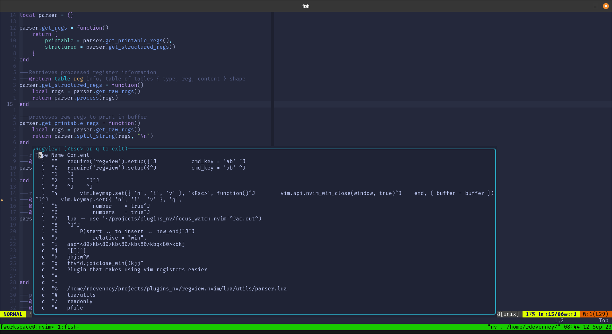

# regview.nvim

<!--toc:start-->
- [regview.nvim](#regviewnvim)
  - [About](#about)
  - [Installation](#installation)
  - [Usage](#usage)
  - [Todo](#todo)
<!--toc:end-->

## About
A neovim plugin that makes the register process more seamless.


## Installation
Install it just like any other Neovim plugin

```lua
use 'ryand67/regview.nvim'
```

## Usage
Simply call the `setup` function in your Neovim config and pass in your desired keyboard command (default is `rv`).
When you hit the key a window will open with your current register content, navigate to the one you want and hit `<cr>`.

```lua
require('regview').setup({
           cmd_key = 'xy' 
        })
```

## Todo
* UI launch on cursor maybe
* Rearrange register content would be cool
